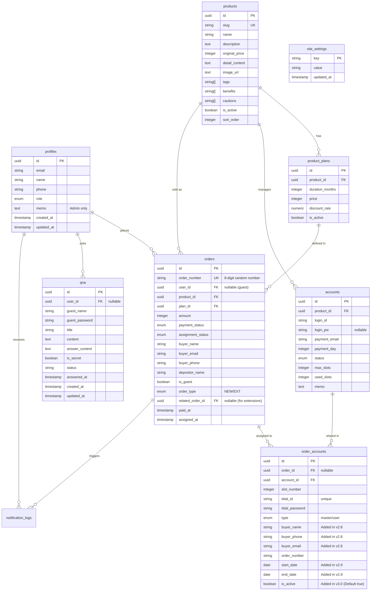

# Dalbus Database Schema (v3.2)

이 문서는 달버스의 데이터베이스 구조와 관계를 정리한 문서입니다. Supabase (PostgreSQL) 환경을 기준으로 합니다.

---

## 1. ERD (Entity Relationship Diagram)

---

## 2. 테이블 목록 및 정의

### 2.1 회원 및 인증 (Membership)
| 테이블명 | 설명 | 비고 |
| :--- | :--- | :--- |
| `profiles` | 사용자 상세 정보 | `auth.users`와 1:1 관계 |

### 2.2 서비스 및 상품 (Commerce)
| 테이블명 | 설명 | 비고 |
| :--- | :--- | :--- |
| `products` | 구독 서비스 (Tidal, YouTube 등) | `slug`로 URL 식별 |
| `product_plans` | 서비스별 이용 기간 및 가격 | 1개월, 3개월 등 |
| `orders` | 결제 및 서비스 이용 내역 | 주문번호 자동 생성 (`ORD-...`) |

### 2.3 계정 관리 (Resource)
| 테이블명 | 설명 | 비고 |
| :--- | :--- | :--- |
| `accounts` | 공유 마스터 계정 풀 | 결제일, 결제계정 정보 포함 |
| `order_accounts` | 주문에 배정된 계정 및 슬롯 정보 | 슬롯 PW, Tidal ID 정보 포함 |

### 2.4 콘텐츠 및 문의 (Content)
| 테이블명 | 설명 | 비고 |
| :--- | :--- | :--- |
| `notices` | 공지사항 게시글 | Enum 기반 카테고리 관리 |
| `faqs` | 자주 묻는 질문 | |
| `faq_categories` | FAQ 카테고리 | 동적 관리 가능 |
| `qna` | 1:1 문의 게시판 | 회원/비회원(비밀번호) 지원 |

### 2.5 시스템 및 설정 (System)
| 테이블명 | 설명 | 비고 |
| :--- | :--- | :--- |
| `site_settings` | 시스템 운영 설정 (Key-Value) | 관리자 이메일, 알림 설정 등 |
| `bank_accounts` | 무통장 입금 계좌 목록 | |
| `notification_logs` | 알림톡/SMS 발송 이력 | |

---

## 3. 상세 테이블 정의

### 3.1 회원 및 인증
#### `profiles` (사용자 프로필)
- `id`: `uuid` (PK, `auth.users.id` 참조)
- `email`: `text` (이메일)
- `name`: `text` (이름)
- `phone`: `text` (연락처, nullable)
- `role`: `user_role` (`user`, `admin`)
- `memo`: `text` (관리자용 메모)
- `created_at / updated_at`: `timestamptz`

### 3.2 서비스 및 상품
#### `products` (구독 서비스 상품)
- `slug`: `text` (URL 식별자, Unique)
- `name`: `text` (상품명)
- `description`: `text` (설명)
- `original_price`: `integer` (원가)
- `detail_content`: `text` (상세 HTML 내용)
- `image_url`: `text` (대표 이미지)
- `tags / benefits / cautions`: `text[]` (태그 / 혜택 / 주의사항 배열)
- `is_active`: `boolean` (활성화 여부)
- `sort_order`: `integer` (출력 순서)

#### `product_plans` (상품 이용권 구성)
- `product_id`: `uuid` (FK -> `products.id`)
- `duration_months`: `integer` (이용 기간)
- `price`: `integer` (결제 금액)
- `discount_rate`: `numeric` (할인율)
- `is_active`: `boolean` (판매 여부)

### 3.3 주문 및 배정
#### `orders` (주문/결제 정보)
- `order_number`: `text` (주문번호, Unique)
- `user_id`: `uuid` (FK -> `profiles.id`, nullable)
- `product_id`: `uuid` (FK -> `products.id`)
- `plan_id`: `uuid` (FK -> `product_plans.id`)
- `amount`: `integer` (최종 결제 금액)
- `payment_status`: `payment_status` (`pending`, `paid`, `failed`, `cancelled`, `refunded`)
- `assignment_status`: `assignment_status` (`waiting`, `assigned`, `expired`, `replaced`, `completed`)
- `order_type`: `order_type` (`NEW`, `EXT`)
- `related_order_id`: `uuid` (연장 주문 시 원본 주문 참조)
- `paid_at / assigned_at`: `timestamptz` (결제일 / 배정일)
- `buyer_name / buyer_phone / buyer_email`: `text` (주문자 정보)
- `is_guest`: `boolean` (비회원 여부)

#### `order_accounts` (배정된 슬롯 정보)
- `order_id`: `uuid` (FK -> `orders.id`, nullable)
- `account_id`: `uuid` (FK -> `accounts.id`)
- `slot_number`: `integer` (슬롯 번호 0~5)
- `tidal_id`: `text` (Tidal 계정 ID)
- `tidal_password`: `text` (Tidal 계정 PW)
- `type`: `account_type` (`master`, `user`)
- `start_date / end_date`: `date` (이용 기간)
- `is_active`: `boolean` (활성 상태)
- `order_number`: `text` (추적용 주문번호)

### 3.4 리소스 관리
#### `accounts` (마스터 계정 풀)
- `product_id`: `uuid` (FK -> `products.id`)
- `login_id / login_pw`: `text` (마스터 로그인 정보)
- `payment_email`: `text` (결제용 이메일)
- `payment_day`: `integer` (결제일)
- `status`: `account_status` (`available`, `assigned`, `disabled`)
- `max_slots / used_slots`: `integer` (최대 / 사용 중인 슬롯 수)

### 3.5 시스템 및 설정
#### `site_settings` (운영 설정 - Key/Value)
- `key`: `text` (PK, 설정 키)
- `value`: `text` (설정 값)
- `updated_at`: `timestamptz`

#### `bank_accounts` (무통장 입금 계좌)
- `bank_name`: `text` (은행명)
- `account_number`: `text` (계좌번호)
- `account_holder`: `text` (예금주)
- `is_active`: `boolean` (노출 여부)

#### `notification_logs` (알림 발송 이력)
- `user_id / order_id`: `uuid` (참조 ID)
- `type`: `notification_type` (`assignment`, `expiry_d7`, `expiry_d1` 등)
- `channel`: `notification_channel` (`sms`, `alimtalk`)
- `status`: `notification_status` (`pending`, `sent`, `failed`)
- `sent_at`: `timestamptz`

### 3.6 게시판 및 고객 문의
#### `notices` (공지사항)
- `category`: `notice_category` (`service`, `update`, `event`, `maintenance`)
- `is_published / is_pinned`: `boolean` (게시 여부 / 고정 여부)

#### `faqs` (자주 묻는 질문)
- `category`: `text` (카테고리명)
- `is_published`: `boolean`

#### `faq_categories` (FAQ 카테고리 관리)
- `name`: `text` (카테고리명, Unique)
- `sort_order`: `integer`

#### `qna` (1:1 문의)
- `is_secret`: `boolean` (비밀글 여부)
- `status`: `text` (`waiting`, `answered`)
- `answer_content`: `text` (답변 내용)
- `answered_at`: `timestamptz` (답변 시각)
