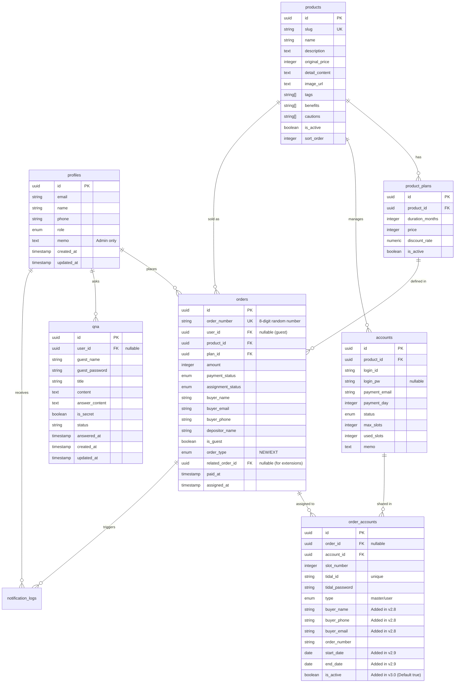

# Dalbus Database Schema (v3.1)

이 문서는 달버스의 데이터베이스 구조와 관계를 정리한 문서입니다. Supabase (PostgreSQL) 환경을 기준으로 합니다.

---

## 1. ERD (Entity Relationship Diagram)

---

## 2. 테이블 목록 및 정의

### 2.1 회원 및 인증 (Membership)
| 테이블명 | 설명 | 비고 |
| :--- | :--- | :--- |
| `profiles` | 사용자 상세 정보 | `auth.users`와 1:1 관계 |

### 2.2 서비스 및 상품 (Commerce)
| 테이블명 | 설명 | 비고 |
| :--- | :--- | :--- |
| `products` | 구독 서비스 (Tidal, YouTube 등) | `slug`로 URL 식별 |
| `product_plans` | 서비스별 이용 기간 및 가격 | 1개월, 3개월 등 |
| `orders` | 결제 및 서비스 이용 내역 | 주문번호 자동 생성 (`ORD-...`) |

### 2.3 계정 관리 (Resource)
| 테이블명 | 설명 | 비고 |
| :--- | :--- | :--- |
| `accounts` | 공유 마스터 계정 풀 | 결제일, 결제계정 정보 포함 |
| `order_accounts` | 주문에 배정된 계정 및 슬롯 정보 | 슬롯 PW, Tidal ID 정보 포함 |

### 2.4 콘텐츠 및 문의 (Content)
| 테이블명 | 설명 | 비고 |
| :--- | :--- | :--- |
| `notices` | 공지사항 게시글 | Enum 기반 카테고리 관리 |
| `faqs` | 자주 묻는 질문 | |
| `faq_categories` | FAQ 카테고리 | 동적 관리 가능 |
| `qna` | 1:1 문의 게시판 | 회원/비회원(비밀번호) 지원 |

### 2.5 시스템 및 설정 (System)
| 테이블명 | 설명 | 비고 |
| :--- | :--- | :--- |
| `site_settings` | 관리자 계정 및 운영 설정 | 관리자 이메일/비밀번호 포함 |
| `bank_accounts` | 무통장 입금 계좌 목록 | |
| `notification_logs` | 알림톡/SMS 발송 이력 | |

---

## 3. 상세 테이블 정의 (주요 테이블)

### `orders` (주문)
- `payment_status`: `pending`, `paid`, `failed`, `cancelled`, `refunded`
- `assignment_status`: `waiting`, `assigned`, `expired`, `replaced`, `completed`
- `order_type`: `NEW` (신규), `EXT` (연장)
- `related_order_id`: 연장 주문인 경우 이전 주문의 UUID를 저장
- `user_id`: 회원 주문인 경우만 존재 (비회원은 `is_guest = true`)

### `accounts` (마스터 계정)
- `login_pw`: 보안상의 이유로 nullable로 관리 가능 (필요 시에만 입력)
- `payment_day`: 매월 결제되는 날짜
- `max_slots`: 기본 6개 설정 (Tidal 기준)

### `order_accounts` (슬롯 배정)
- `type`: `master` (마스터 계정 정보), `user` (일반 사용자)
- `slot_number`: 0~5 번호 부여
- `tidal_id`: 슬롯별 개별 소속 ID (독립 계정 방식), `is_active=true`인 경우만 UNIQUE 제약 적용 (Partial Index)
- `order_number`: 주문번호 중복 저장 (추적성 강화)
- `is_active`: 배정 활성화 여부 (기본값 true). 만료/종료 시 false로 업데이트하여 슬롯 확보.

### `site_settings` (운영 설정)
- `admin_login_id`: 관리자 로그인 ID
- `admin_email`: 주문 알림(Resend) 수신용 이메일
- `admin_phone`: 향후 알림톡 수신용 번호
