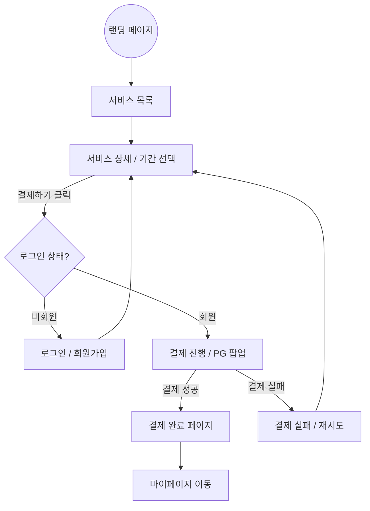
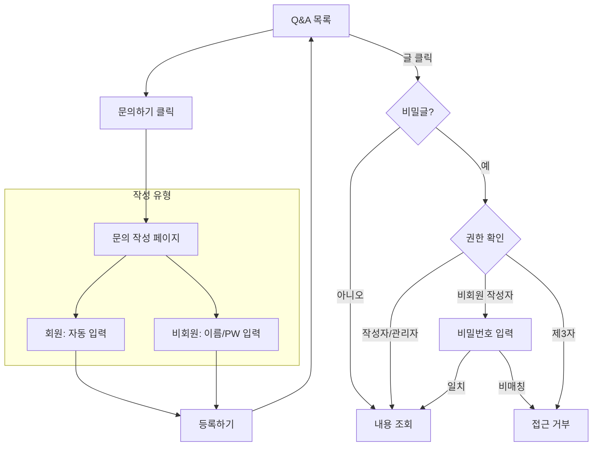
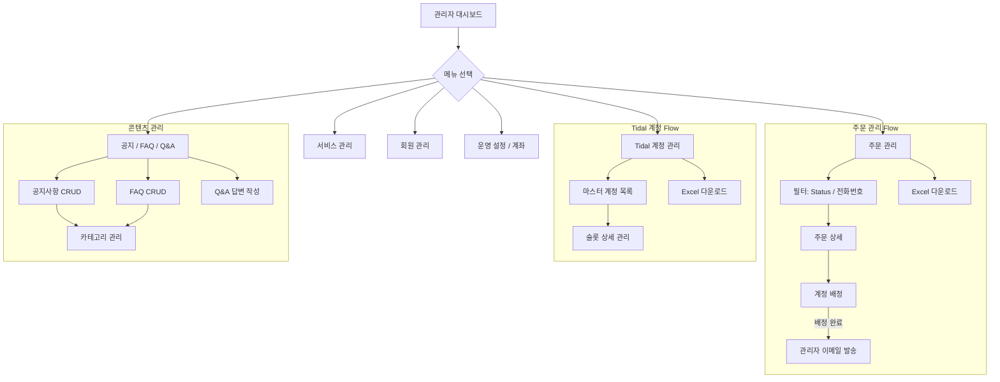
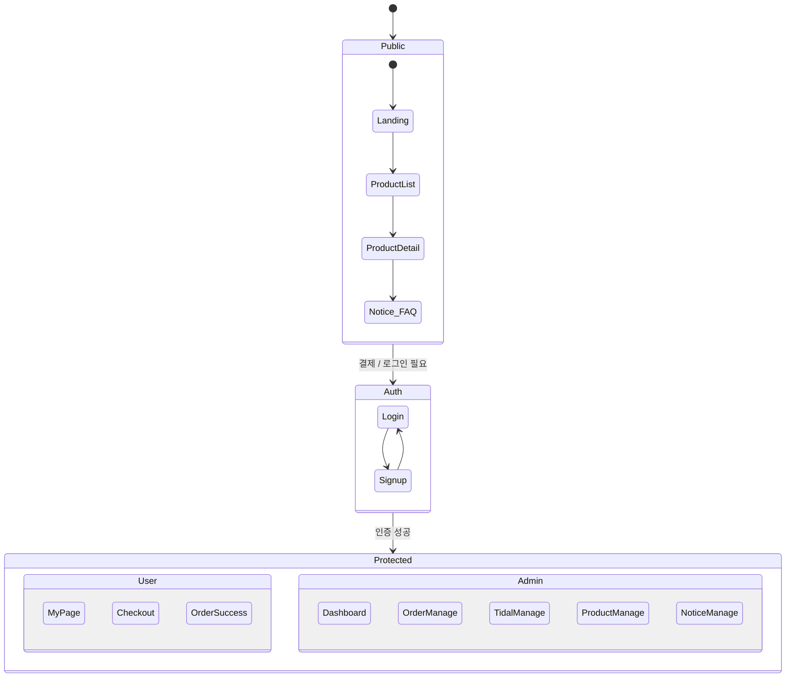

# Dalbus Screen Flow (Mermaid Visualization)

This document provides a visual representation of the Dalbus platform's screen flow using Mermaid diagrams.

## 1. User Order Flow (Member & Guest)

---

## 2. Q&A Process

---

## 3. Admin Management Flow

---

## 4. Full System Architecture Overview

