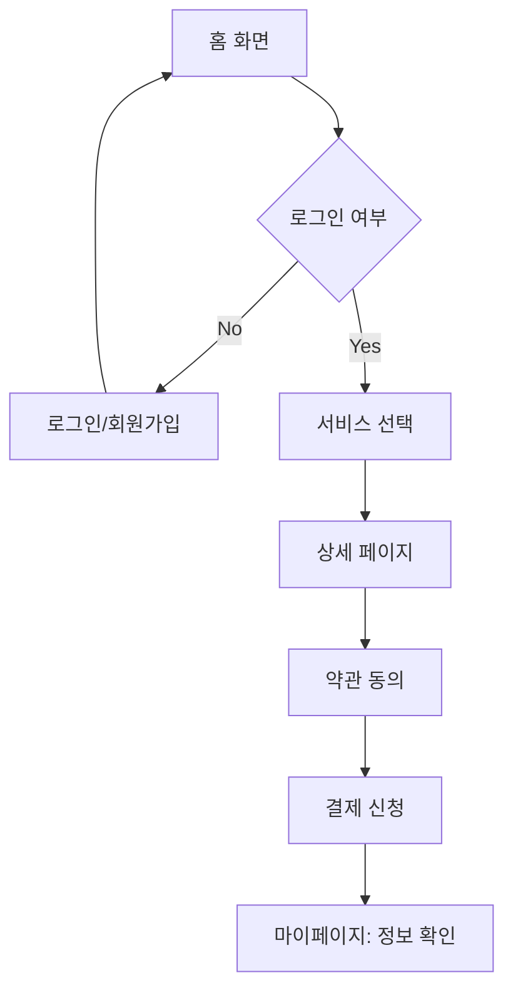

# 달버스(Dalbus) 화면 기획서 (Screen Specification)

본 문서는 '달버스' 웹 서비스의 주요 화면 구성, UI/UX 요소 및 사용자 흐름을 정의합니다.

---

## 1. 디자인 시스템 (Design System)

| 요소 | 정의 | 비고 |
| :--- | :--- | :--- |
| **Color Palette** | Primary: #5C7CFA (Indigo), BG: Gradient (White to Gray) | 신뢰성과 역동성 강조 |
| **Typography** | Inter, System Font | 가독성 중심의 산세리프 |
| **UI Style** | Glassmorphism, Rounded Corners (20px) | 프리미엄 느낌의 투명 레이어 |
| **Breakpoint** | Mobile: Max 480px, PC: Max 1200px | 모바일 퍼스트 반응형 |

---

## 2. 화면 목록 및 상세

### 2.1 메인 홈 (Home)
- **목적**: 서비스 가치를 전달하고 이용 가능한 OTT 리스트를 노출함.
- **주요 구성**:
  - **헤더**: 로고, 로그인 버튼 또는 사용자 이름, 어드민 링크.
  - **히어로 섹션**: "60% 절약" 문구와 애니메이션.
  - **서비스 그리드**: 타이달, 넷플릭스 등 카드 리스트. (실시간 가격 반영)
  - **하단 네비게이션**: 홈, 마이페이지 아이콘.

### 2.2 서비스 상세 및 구독 신청 (Service Detail)
- **목적**: 특정 서비스의 가격을 확인하고 구독 신청을 완료함.
- **주요 구성**:
  - **상단바**: 뒤로가기 버튼, 서비스명.
  - **가격 카드**: 월 이용료 및 서비스 설명.
  - **기간 선택**: 1개월, 3개월 선택 옵션 (3개월 시 할인율 자동 계산).
  - **약관 동의**: 체크박스 선택 시에만 하단 버튼 활성화.
  - **결제 버튼**: 클릭 시 시뮬레이션 로딩 후 마이페이지로 이동.

### 2.3 마이페이지 (My Page)
- **목적**: 사용자의 구독 상태와 계정 정보(ID/PW)를 확인함.
- **주요 구성**:
  - **구독 카드**: 이용 중인 서비스 아이콘, 종료일, 상태 배지.
  - **계정 정보**: 배정된 ID와 Password 노출 (복사 가능 스타일).
  - **메뉴 리스트**: 결제 내역, 고객 센터, 로그아웃 등.

### 2.4 로그인 및 회원가입 (Auth)
- **목적**: 사용자 식별 및 정보 수집.
- **주요 구성**:
  - **로그인**: 아이디, 비밀번호 입력 필드.
  - **회원가입**: 아이디, 비밀번호, 이메일, 이름 4개 항목 수집.
  - **유효성 검사**: 모든 필드 입력 확인.

### 2.5 관리자 대시보드 (Admin)
- **목적**: 운영자가 주문을 관리하고 서비스 가격을 조정함.
- **주요 구성**:
  - **통계 카드**: 신규 주문, 대기 건수, 매출 통계.
  - **주문 내역**: 리스트 형태의 주문 관리.
  - **가격 설정**: 실시간 가격 수정 및 전역 반영 기능.
  - **계정 관리**: 새 계정 정보 입력 및 업데이트.

---

## 3. 사용자 흐름 (User Flow)

---

## 4. 인터랙션 정의
- **마이크로 애니메이션**: 카드 호버/터치 시 미세한 확대 효과.
- **로딩 상태**: 결제 클릭 시 '결제 처리 중...' 문구와 함께 버튼 비활성화.
- **데이터 동기화**: 어드민에서 변경한 가격이 즉시 전체 사이트에 반영됨 (LocalStorage & Context API).
